# UYFSR Designer Schedule

A shared schedule for the poster rotation. It decides **who designs the next poster**, holds the **topic** for each slot, takes the **submission**, and walks it through **review** — with everything backed up automatically.

No installation and no build step — it's a set of plain HTML/CSS/JS files that run directly in the browser.

---

## What this actually does

- Every **Friday and Saturday**, one designer from the rotation is on the hook for a poster.
- Anyone can open the site and see who's up, search for a name, and check a deadline.
- The assigned designer uploads their poster before the deadline.
- **Only an admin can see the uploaded poster and approve it.** Normal visitors and designers never see the image itself — they only see its status (*In review*, *Approved*, etc.).
- Admins can assign topics, review submissions, manage the roster, and export backups.

---

## Table of contents

1. [For everyone — checking the schedule](#1-for-everyone--checking-the-schedule)
2. [Signing in as an admin](#2-signing-in-as-an-admin)
3. [Assigning a topic](#3-assigning-a-topic)
4. [Submitting a poster](#4-submitting-a-poster)
5. [Reviewing a submission](#5-reviewing-a-submission-admin-only)
6. [Managing the roster](#6-managing-the-roster)
7. [Controls — rotation, sequence, submission code](#7-controls--rotation-sequence-submission-code)
8. [Backups](#8-backups)
9. [Activity log](#9-activity-log)
10. [Works on your phone too](#10-works-on-your-phone-too)
11. [Running it yourself / deploying](#11-running-it-yourself--deploying)
12. [Project structure](#12-project-structure)
13. [Security notes — please read](#13-security-notes--please-read)

---

## 1. For everyone — checking the schedule

Open the site and you land on **Schedule**. Every card is one slot: the date, who's assigned, the topic, and its current status.

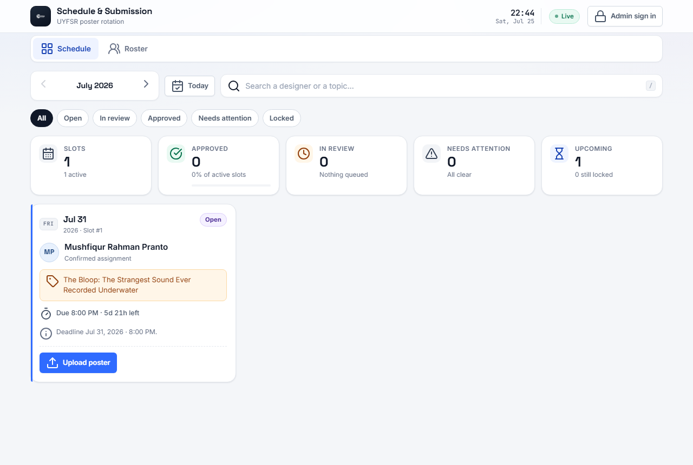

Use the search box to jump straight to a designer or a topic — handy for "when am I up next?".

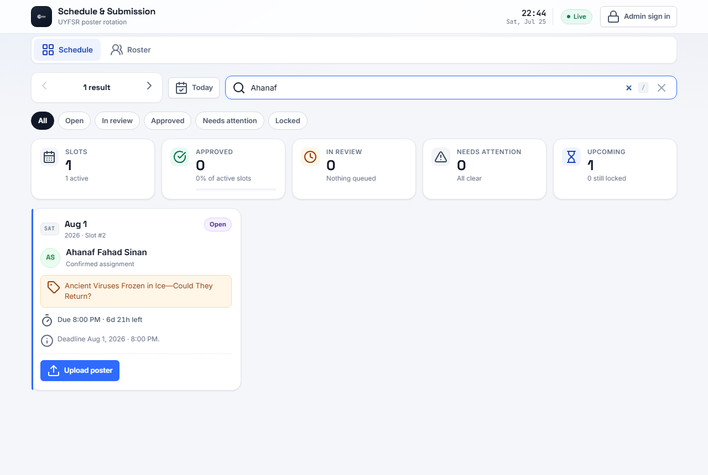

The filter chips (`All`, `Open`, `In review`, `Approved`, `Needs attention`, `Locked`) narrow the list down instantly. Nobody needs an account for any of this.

---

## 2. Signing in as an admin

Click **Admin sign in** in the top-right corner and enter your username and password.

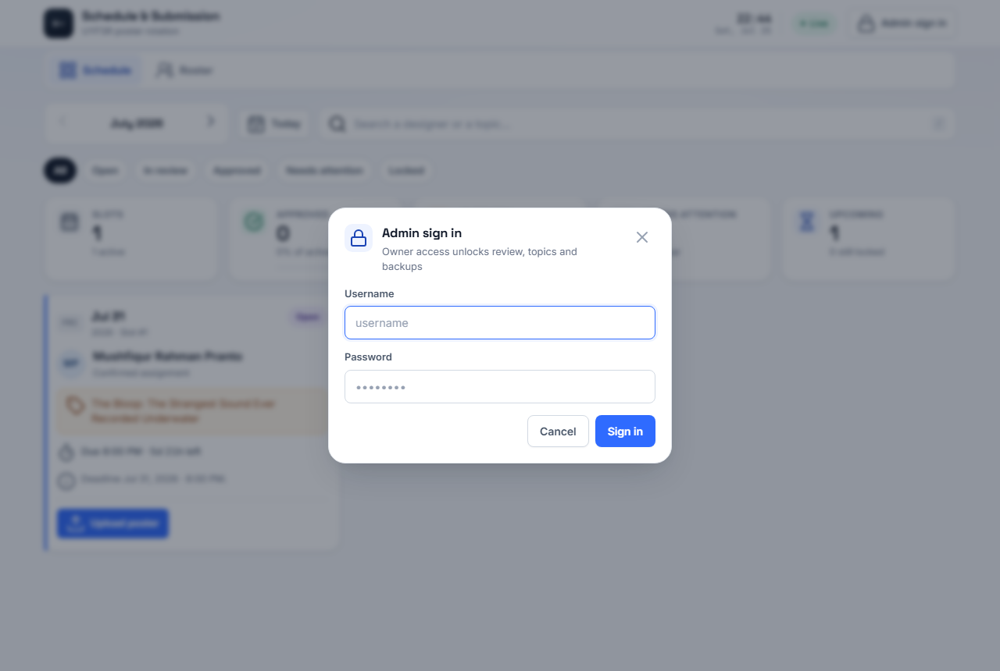

Once signed in, three extra tabs appear — **Controls**, **Backup**, and **Activity** — and the schedule cards unlock admin-only actions like approving and reassigning.

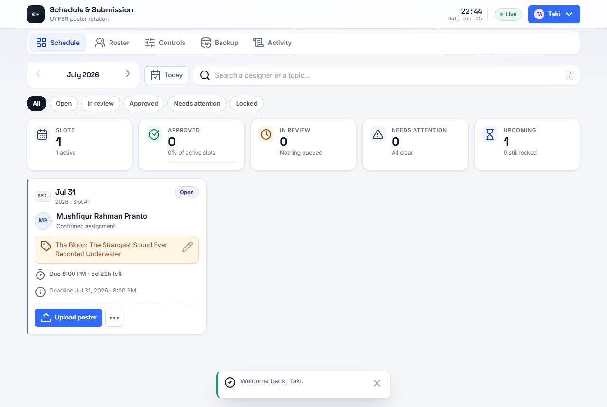

> Sessions expire automatically after 45 minutes of inactivity, so a shared computer doesn't stay signed in forever.

---

## 3. Assigning a topic

Click any topic box on a card (admin only) to set or change what that slot's poster should be about.

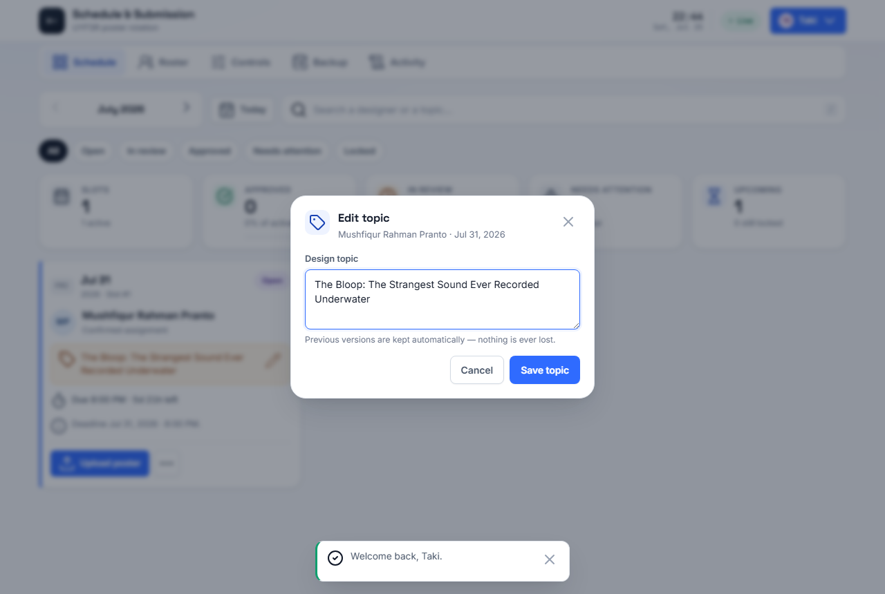

Every previous version of a topic is kept automatically — nothing is ever silently overwritten.

---

## 4. Submitting a poster

Anyone can click **Upload poster** on an open slot. You'll be asked for your name (so the submission is attributed to a real person) and then pick the image file(s).

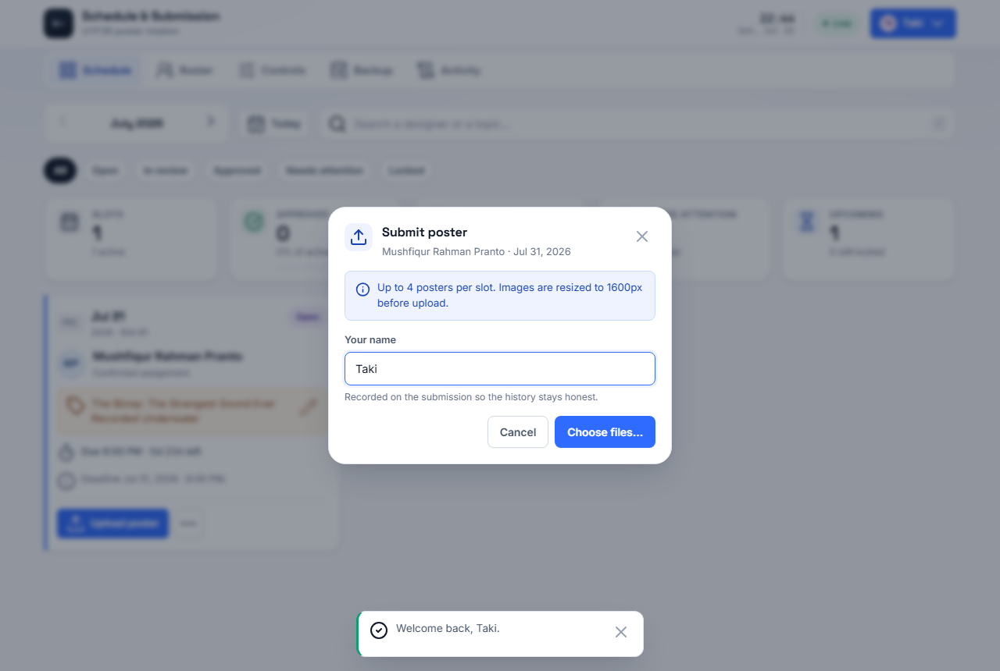

A few things happen automatically:
- Images are resized and compressed before upload, so a giant phone photo doesn't need to be resized manually.
- Up to 4 posters can be attached to one slot.
- Uploading after the deadline is still accepted during a 24-hour grace period — it's just flagged as **late**.

After uploading, the card shows **In review** — the poster itself is only visible to admins from this point on.

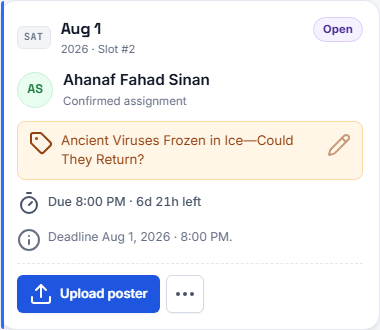

---

## 5. Reviewing a submission (admin only)

Admins see the actual poster thumbnail — tap it to view full-size — plus **Approve**, **Request changes**, and **Download**.

- **Approve** locks the slot in as done.
- **Request changes** sends it back with a note explaining what to fix.
- The **⋯** menu also lets an admin reassign the slot, swap it with another date, or cancel it (for holidays, exam weeks, etc.) without disturbing anyone else's rotation.

---

## 6. Managing the roster

The **Roster** tab shows every designer with their next slot and a reliability score — how often they've come through on time. Reliability only counts slots that have actually resolved; anything upcoming is never held against anyone.

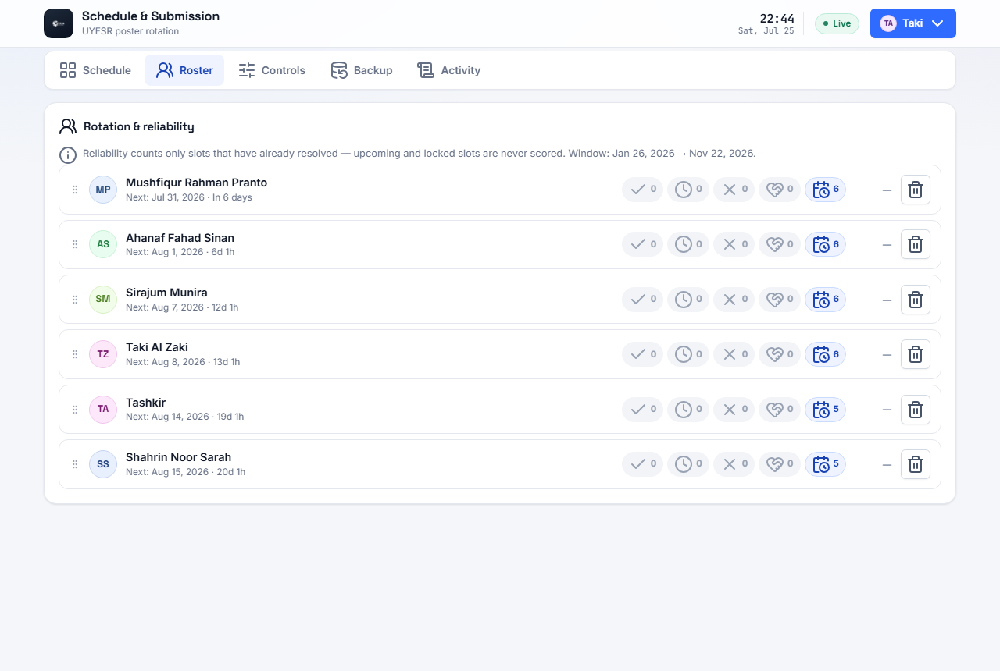

Admins can drag rows to reorder the rotation, or remove/add designers from the **Controls** tab.

---

## 7. Controls — rotation, sequence, submission code

Everything an admin needs to steer the rotation lives here: add or remove designers, nudge the whole rotation forward or back by one person, set an optional submission code, and reassign or swap specific upcoming slots.

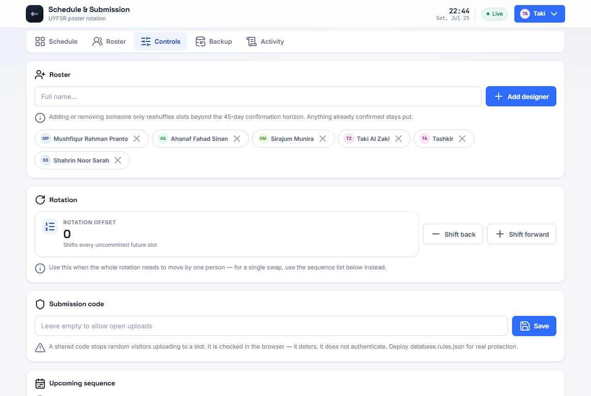

> Adding or removing a designer only affects slots more than 45 days out. Anything already confirmed inside that window stays exactly as it is — nobody's near-term assignment shifts because the roster changed.

---

## 8. Backups

The **Backup** tab is the safety net for the one thing that can't be regenerated: topics.

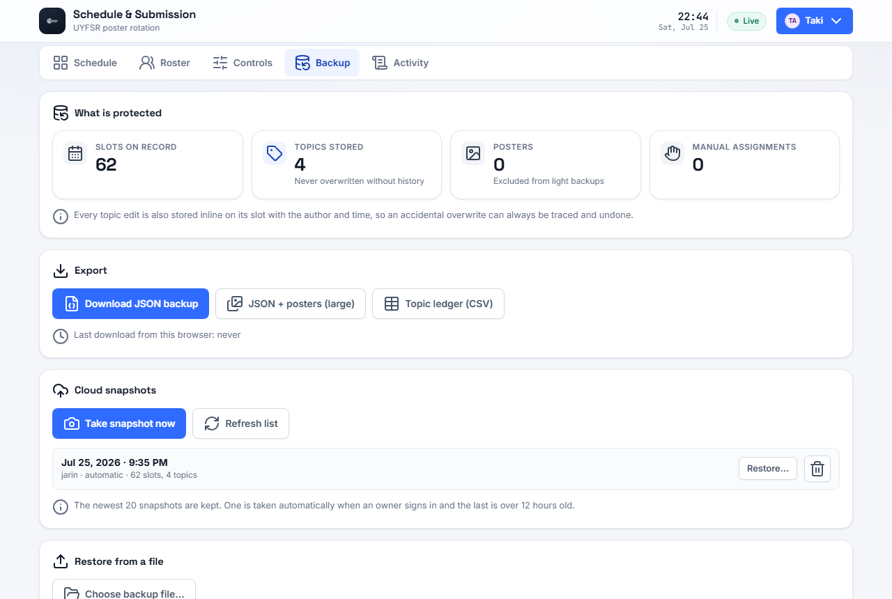

- **Export** a full JSON backup, or just a topic ledger as a CSV for a spreadsheet.
- **Cloud snapshots** are taken automatically (and can be triggered manually) and kept for a rolling window.
- **Restore** always shows a before/after diff first — you choose *merge* (fill gaps only, never overwrite live work) or *replace* (overwrite matching slots) before anything is written.

---

## 9. Activity log

Every sign-in, topic edit, upload, approval, and backup is recorded with who did it and when.

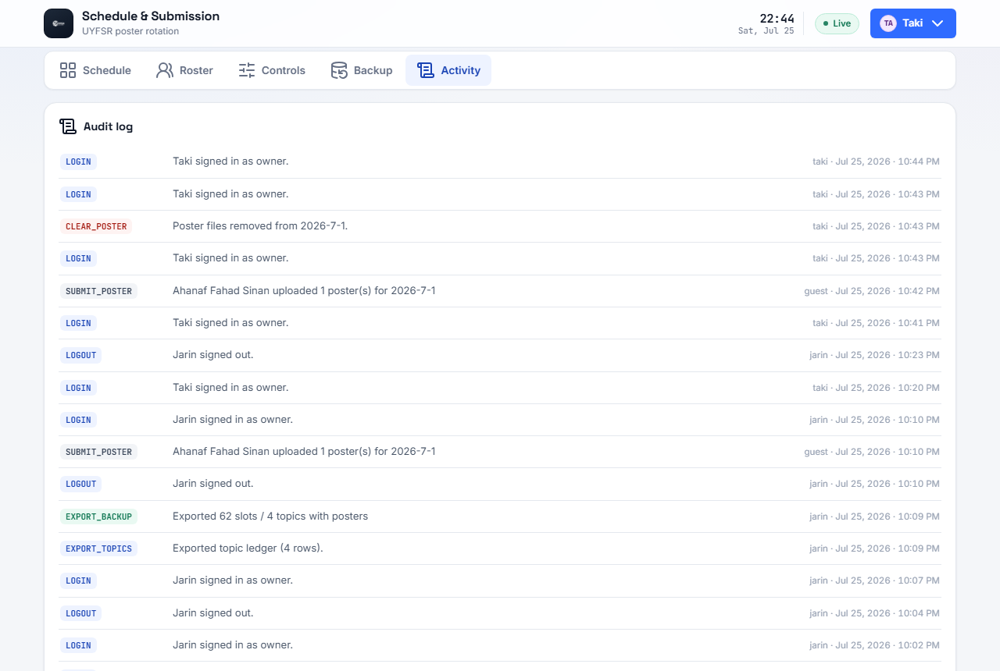

---

## 10. Works on your phone too

The whole interface is responsive — checking the schedule or uploading a poster from a phone works the same as on a desktop.

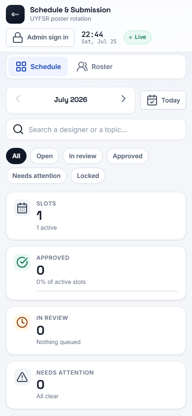

---

## 11. Running it yourself / deploying

This is a static site — there is no server-side code to build or run.

**Locally:**
```bash
npx serve .
```
then open the printed `http://localhost:...` address. (Opening `index.html` directly with `file://` will *not* work — admin sign-in needs `crypto.subtle`, which browsers disable outside of `http(s)://` or `localhost`.)

**Deployed:** this repo is set up for [Cloudflare Workers](https://developers.cloudflare.com/workers/) static assets (see `wrangler.jsonc`) — pushing to `main` is enough if it's connected to a Cloudflare project. Any static host (GitHub Pages, Netlify, Vercel, etc.) works just as well since it's plain HTML/CSS/JS.

---

## 12. Project structure

```
index.html                  markup only — no logic
css/theme.css                design tokens, reset, shared primitives
css/app.css                  layout and components
js/config.js                 every tunable value (schedule rules, accounts, limits)
js/util.js                   dates, strings, hashing, downloads
js/schedule.js                the rotation engine — pure, never writes to the database
js/store.js                   the data layer — validation, retry, offline cache
js/auth.js                    sign-in, session, lockout
js/images.js                  poster downscale + compression pipeline
js/backup.js                  snapshots, export, import, restore
js/ui.js                       toasts, dialogs, the poster lightbox
js/app.js                     views, rendering, everything the buttons do
database.rules.json           Firebase security rules — see below
database.rules.auth.json      stricter rules, once Firebase Auth is enabled
tools/hash-password.html      generate a new admin account's password hash
tools/verify-schedule.js      node tools/verify-schedule.js — checks the rotation logic
tools/verify-wiring.js        node tools/verify-wiring.js — checks every button is wired up
SETUP.md                      full technical documentation
```

---

## 13. Security notes — please read

Signing in hides the admin controls from casual visitors. **It does not, by itself, protect the database.** Real protection comes from `database.rules.json`.

**Deploy the rules** (from the Firebase console → Realtime Database → Rules, or `firebase deploy --only database`) so that:
- every field is type- and size-checked before it's accepted
- posters are capped in size and must actually be images
- nothing can be silently deleted, only cleared

Full details, including how to add real Firebase Authentication on top, are in [SETUP.md](SETUP.md).

To change an admin password, open `tools/hash-password.html` (over `http(s)://`, not `file://`), generate a new hash, and paste it into `js/config.js`.
